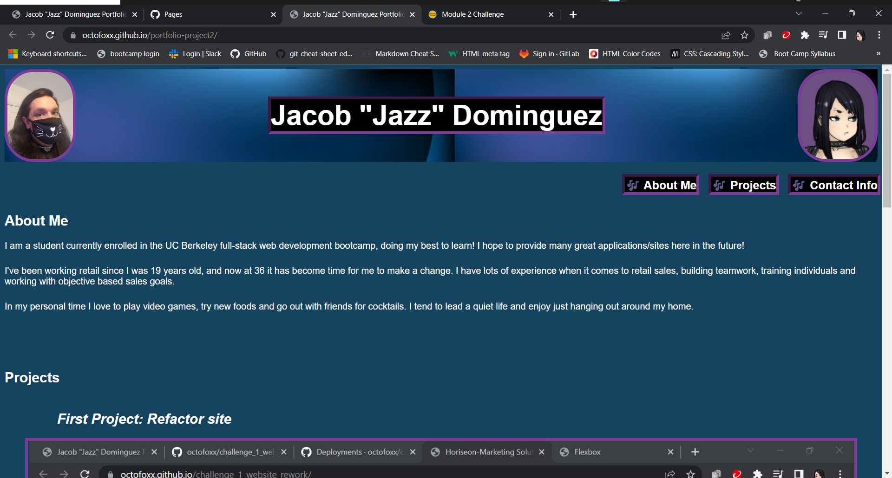

# portfolio-project2

## Description

This Project was designed to build a portfolio for future use to display and show off applications. Ideally it will get filled with amazing things I build throughout this bootcamp!

I tried to include a fair amount of advanced CSS selectors we we learnt this week along with the css flexbox properties to build my projects section in a clean but responsive way. It was not easy and I did hit some snags but I think it works as intended and while it may not be what i envisioned, I am proud of what I was able to accomplish.

I learnt that trying to set up flex wrap and flex grow properties is not as"set and forget" as I thought it would be: making sure everything squishes nicely when going to smaller screens is not easy!

## Installation

N/A

## Usage

<https://octofoxx.github.io/portfolio-project2/>  

<https://github.com/octofoxx/portfolio-project2>

## Screenshot

## Credits

<https://www.webdesignhot.com/free-vector-graphics/free-abstract-blue-background-vector-graphic/> -for the background image in the header section.

## License

N/A
